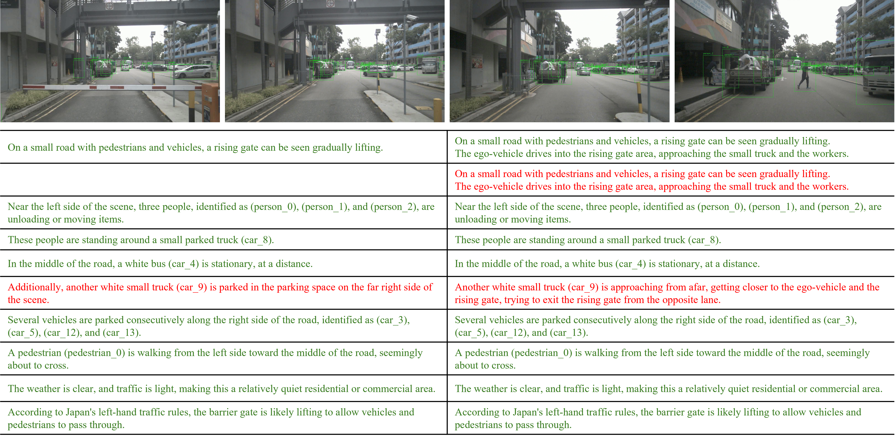
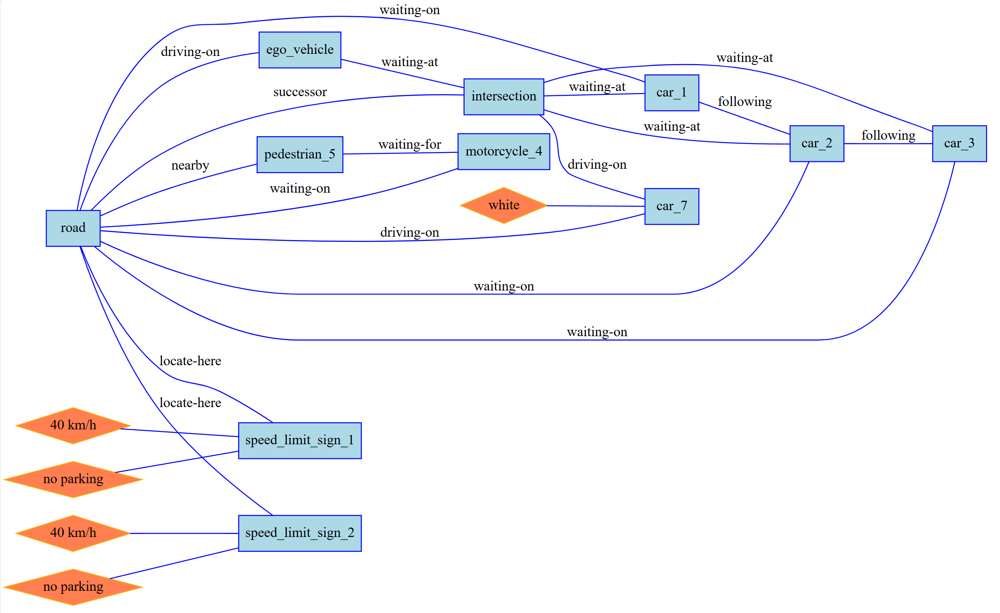
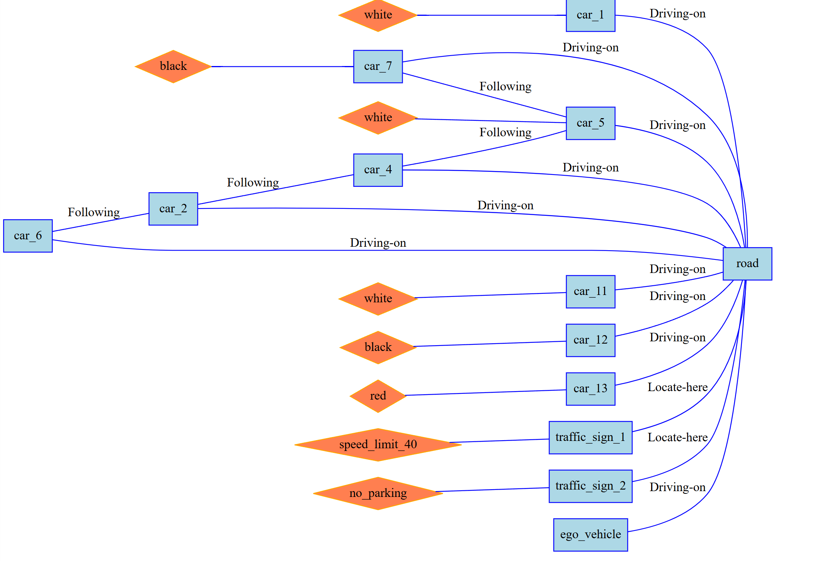
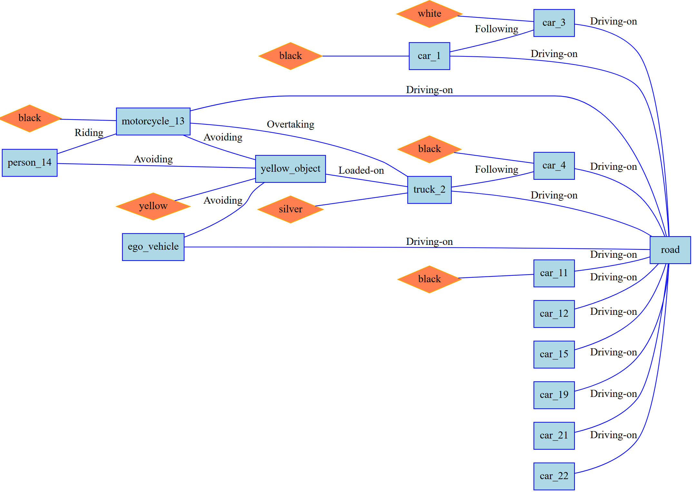

# RSG-LLM
Publication version of RSG-LLM Benchmark Dataset

Current version: RSG-LLM mini
Before the paper is accepted, we release a mini version of the RSG-LLM dataset for reference.
The complete dataset will be released after the paper is accepted.

For detailed information, please refer to our paper. (Still under review)


## Some samples:




## Some Graph Data Samples:






## Data Structure

The RSG-LLM dataset is organized as follows:

```
RSG-LLM 
    |- .gitignore
    |- README.md
    |- text_description    
        |- NEDO
            *- autoware-20200909102751_0094_02_text_description_ZH_CN.json
            *- autoware-20200909102751_0094_02_text_description_EN.json
            *- ...
        |- nuScenes
            *- scene_0_text_description_ZH_CN.json
            *- scene_0_text_description_EN.json
            *- ...
        |- road_hazard_stimuli
            * noaudio_c_001_critical_swerve_text_description.json
            * noaudio_c_001_critical_swerve_text_description_EN.json
            * ...
    |- graph_data          
        |- NEDO
            *- autoware-20200909102751_0094_02_graph_data.json
            *- autoware-20200909102751_0094_02_graph_data.svg   
            *- ...
        |- nuScenes
            *- scene_0_graph_data.json
            *- scene_0_graph_data.svg
            *- ...
        |- road_hazard_stimuli
            * noaudio_c_001_critical_swerve_graph_data.json
            * noaudio_c_001_critical_swerve_graph_data.svg
            * ...

```

Structure for `text_description`:
```json
{
    "scene_base_name": str,                    
    "gpt_scene_description_list": List[str],     # Scene description generated by GPT4o, separated by lines
    "corrected_annotations": List[Data_Sample_Annotation]  
}
```

Structure for `graph_data`:
```json
{
    "graph": {
        "nodes": [   
            {
                "name": "car_1",
                "type": "car"
            }
            {
                "name": "person_1",
                "type": "person"
            }
            ...
        ],
        "attributes": [  
            {
                "value": "black",
                "belong_to": "car_1"
            }
            ...
        ],

        "edges": [
            {
                "object_1": "car_1",
                "object_2": "person_1",
                "type": "waiting_for"
            }
            ...
        ]
    }
}
```
'''